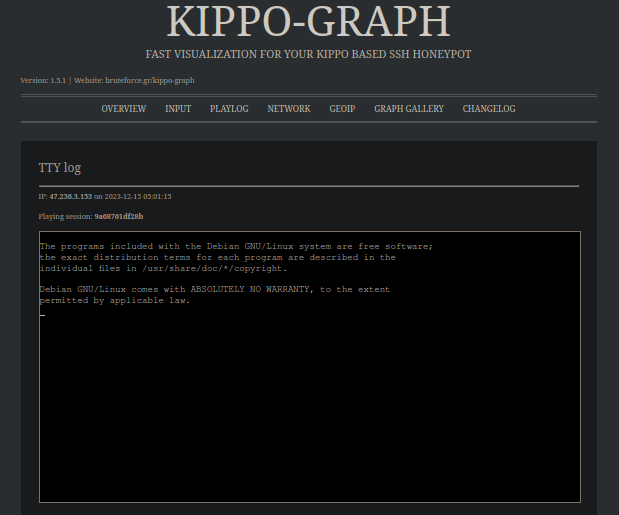

<h1 align="center">Dockerized SSH honeypot with graphical analyzer</h1>

An all in one functional docker-compose project for the popular cowrie ssh honeypot project. In addition, a kippo-graph container will be deployed to graphically analyze the attacks.

<br/>

<p align="center">
  
</p>

<br/>

**❗️ Please do not use if you do not know exactly how to secure the entire system. kippo-graph has not been maintained for a long time (12/2023).**

# Installation

1. Clone the repo
   ```sh
   git clone https://github.com/luftl0ch/Dockerized-cowrie-honeypot-with-kippo-graph.git && cd Dockerized-cowrie-honeypot-with-kippo-graph
   ```
2. Execute docker-compose.
   ```sh
    docker-compose up 
   ```
3. Kippo-graph will be available at http://127.0.0.1:8888

You can change the Port of kippo-graph in the .env file. <br/>The database credentials are preconfigured in the following files: `.env` `configs/cowrie.cfg` `configs/graph-config.php`